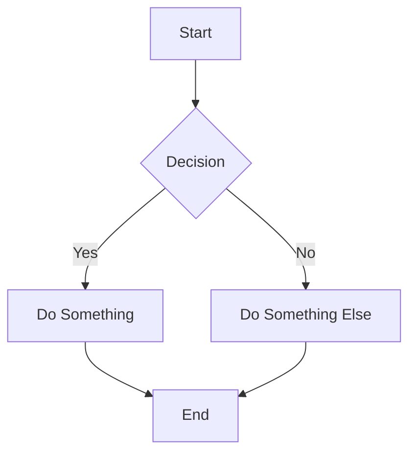
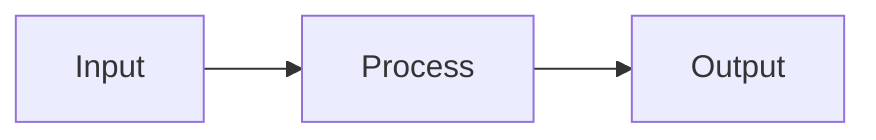

# MD to PDF MCP Server

[](https://www.npmjs.com/package/md-to-pdf-mcp)
[](https://opensource.org/licenses/MIT)

An MCP (Model Context Protocol) server for converting Markdown documents to beautifully styled PDF files.

## ⚡ One-Click Install

### Install in Cursor

[](cursor://anysphere.cursor-deeplink/mcp/install?name=md-to-pdf&config=eyJjb21tYW5kIjoibnB4IiwiYXJncyI6WyIteSIsIm1kLXRvLXBkZi1tY3AiXX0%3D)

<details>
<summary>📋 Manual Cursor Installation</summary>

Add to your `~/.cursor/mcp.json`:

```json
{
  "mcpServers": {
    "md-to-pdf": {
      "command": "npx",
      "args": ["-y", "md-to-pdf-mcp"]
    }
  }
}
```
</details>

### Install in Claude Desktop

[](claude://mcp/install?name=md-to-pdf&config=eyJjb21tYW5kIjoibnB4IiwiYXJncyI6WyIteSIsIm1kLXRvLXBkZi1tY3AiXX0%3D)

<details>
<summary>📋 Manual Claude Desktop Installation</summary>

Add to your Claude Desktop config (`~/Library/Application Support/Claude/claude_desktop_config.json` on macOS):

```json
{
  "mcpServers": {
    "md-to-pdf": {
      "command": "npx",
      "args": ["-y", "md-to-pdf-mcp"]
    }
  }
}
```
</details>

---

## ✨ Features

- 📄 **High-Quality PDF Output** - Uses Puppeteer with Chrome for pixel-perfect rendering
- 🎨 **Beautiful Typography** - Modern serif fonts with excellent readability
- 💻 **Syntax Highlighting** - Code blocks with syntax highlighting via highlight.js
- 📊 **Mermaid Diagrams** - Full support for flowcharts, sequence diagrams, Gantt charts, and more
- 📐 **Flexible Paper Sizes** - Support for Letter, A4, Legal, and more
- 💧 **Watermarks** - Optional watermark text on all pages or first page only
- 🔢 **Page Numbers** - Optional page numbering in footer
- 📑 **Headers & Footers** - Custom header and footer text
- 🌙 **Code Themes** - Light and dark themes for code blocks
- 🎨 **Custom CSS Styling** - Inject your own CSS for complete customization
- 🚀 **Large File Support** - 4GB memory allocation with dynamic timeouts

## 📊 Mermaid Diagram Support

Create beautiful diagrams directly in your Markdown:

````markdown

````

**Supported diagram types:**
- Flowcharts
- Sequence diagrams
- Class diagrams
- State diagrams
- Entity Relationship diagrams
- Gantt charts
- Pie charts
- Git graphs

## 🚀 Quick Start Examples

### Basic PDF Generation

```
Convert this markdown to PDF:

# My Document

This is a **test document** with some content.

## Code Example

```python
def hello():
    print("Hello, World!")
```
```

### With Mermaid Diagram

```
Create a PDF with this flowchart:

# Process Flow


```

### Professional Report

```
Generate a professional PDF report with:
- Page numbers
- Header: "Confidential Report"
- A4 format
- Watermark: "DRAFT"

Content:
# Quarterly Report Q4 2024

## Executive Summary
...
```

### Custom Styling

```
Generate a PDF with custom CSS styling:

Content:
# Styled Document

Custom CSS:
```css
h1 { color: #2c3e50; border-bottom: 3px solid #3498db; }
p { font-size: 12pt; line-height: 1.8; }
code { background: #fffacd; color: #d63384; }
```
```

---

## 📖 Supported Markdown Features

| Feature | Supported |
|---------|-----------|
| Headers (all levels) | ✅ |
| Bold, Italic, Strikethrough | ✅ |
| Ordered & Unordered Lists | ✅ |
| Task Lists (checkboxes) | ✅ |
| Code Blocks with Syntax Highlighting | ✅ |
| Tables | ✅ |
| Blockquotes | ✅ |
| Links | ✅ |
| Images | ✅ |
| Horizontal Rules | ✅ |
| **Mermaid Diagrams** | ✅ |

## 🛠️ Installation

### Via npm (Global)

```bash
npm install -g md-to-pdf-mcp
```

### Via npx (No Install)

```bash
npx -y md-to-pdf-mcp
```

### From Source

```bash
git clone https://github.com/ankitpro/md-to-pdf-mcp.git
cd md-to-pdf-mcp
npm install
npm run build
```

## 📝 Tool Reference

### `convert_markdown_to_pdf`

| Parameter | Type | Required | Default | Description |
|-----------|------|----------|---------|-------------|
| `markdown` | string | ✅ | - | The Markdown content to convert |
| `outputFilename` | string | ❌ | `output.pdf` | Filename for the output PDF |
| `paperFormat` | string | ❌ | `letter` | Paper size (letter, a4, legal, etc.) |
| `paperOrientation` | string | ❌ | `portrait` | portrait or landscape |
| `margin` | string | ❌ | `2cm` | Page margins in CSS units |
| `watermark` | string | ❌ | - | Watermark text (max 15 chars) |
| `watermarkScope` | string | ❌ | `all-pages` | all-pages or first-page |
| `showPageNumbers` | boolean | ❌ | `false` | Show page numbers in footer |
| `headerText` | string | ❌ | - | Text for page header |
| `footerText` | string | ❌ | - | Text for page footer |
| `codeTheme` | string | ❌ | `light` | light or dark code theme |
| `customCss` | string | ❌ | - | Custom CSS to apply to PDF |

## ⚙️ Environment Variables

| Variable | Description | Default |
|----------|-------------|---------|
| `MD2PDF_OUTPUT_DIR` | Directory for output PDF files | User's home directory |
| `MD2PDF_VERBOSE` | Enable verbose logging (`true`/`false`) | `false` |

### Configuration Example

```json
{
  "mcpServers": {
    "md-to-pdf": {
      "command": "npx",
      "args": ["-y", "md-to-pdf-mcp"],
      "env": {
        "MD2PDF_OUTPUT_DIR": "/path/to/output",
        "MD2PDF_VERBOSE": "true"
      }
    }
  }
}
```

## 📏 Supported Paper Formats

- `letter` (8.5" × 11")
- `legal` (8.5" × 14")
- `tabloid` (11" × 17")
- `ledger` (17" × 11")
- `a0` through `a6`

## 🔧 Large File Support

The tool automatically handles large markdown files with:

- **Dynamic Timeouts**: Automatically scales based on content size (up to 5 minutes)
- **4GB Memory Allocation**: Chrome configured for complex documents
- **Size Validation**: Maximum 10MB file size with clear error messages
- **Progress Tracking**: Shows content size, line count, and processing time

## 📦 Dependencies

- `@modelcontextprotocol/sdk` - MCP SDK
- `marked` - Markdown parser
- `highlight.js` - Syntax highlighting
- `puppeteer` - PDF generation with Chrome

## 🧑‍💻 Development

```bash
# Install dependencies
npm install

# Build
npm run build

# Run in development
npm run dev

# Start the server
npm start
```

## 📜 License

MIT

## 🤝 Contributing

1. Fork the repository
2. Create your feature branch (`git checkout -b feature/amazing-feature`)
3. Commit your changes (`git commit -m 'Add amazing feature'`)
4. Push to the branch (`git push origin feature/amazing-feature`)
5. Open a Pull Request

---

<p align="center">
  Made with ❤️ for the MCP community
</p>
